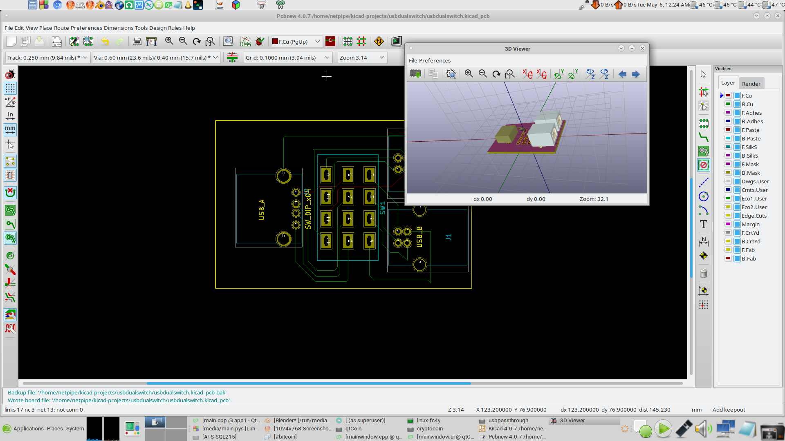

https://github.com/ganquan0910/qt5-sqlite-connection-example

usb mechanical switch example
https://netpipe.ca/wp-content/uploads/2019/11/1024x768-Screenshot-at-2019-11-15-02-47-29.png

GPL project

outline

coin addresses will be valued at .25 or .50 cents to keep the addresses fewer

2 master keys name and coin key, one used to protect customers names after account creation incase of server theft also coin key used to verify coins being spent. the name key is only needed during account creation or maintenance to verify someone has lost their coins.

randomize coin locations after generating bruteforce combinations and use index number as part of encryption.

year dated 2020ABC45678 8 alphanumeric accountnumber idea so the database knows where to look for account might be encrypted based on name for coin verification.

coins will be encrypted from encrypted users name with a user generated rsa+aes key also the master coin key.

name is double encrypted with rsa and aes, to protect customers incase of theft. can use a new encryption key each year if desired to further increase security.

ledger/coin address generator based on set ammount of coins . account number can be year+ random 8 letter/number address encrypted with rsa+aes

3 databases valid coins and customer holdings and available coins also possability to split the holdings databases by year to keep size lower and faster to search. use verify method to double check all coins accounted for. also md5sums

decrypt when spent to verify validity in valid coins database.

to be spent on a centralized system

validation false count to disable account (call for service) 

offline coldstorage validation through usb switch with electronic controller to switch thumbdrive between 2 computers hourly or daily

frontend(online computer) and/or clients card keeps account balances for querry's and quick checks

functions
	transfer between accounts
	verify coins - get total holdings

